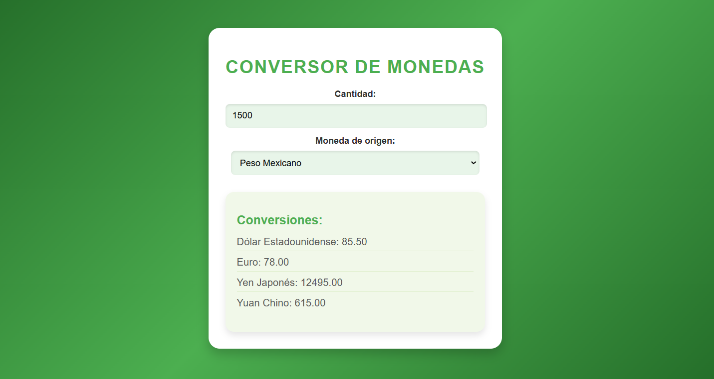

# Conversor de Monedas

## Description

**Currency Converter** is an interactive application that allows you to easily convert amounts between different currencies. Designed with a user-friendly interface and pleasant colors, this tool is ideal for users who need to make quick and accurate conversions.

## Characteristics

- **Source currency selection:** The user can choose between different currencies such as Mexican Peso (MXN), US Dollar (USD), Euro (EUR), Japanese Yen (JPY) and Chinese Yuan (CNY).
- **Real-time results:** Conversions are displayed dynamically when entering an amount and selecting a currency.
- **Modern interface:** Features a minimalist design with a green color gradient, stylish buttons, and clear data presentation.
- **Accessibility:** Compatible with desktop and mobile devices.

## Screenshots



## Project Requirements

- **Node.js:** Node.js needs to be installed to run the project.
- **Modern Browser:** Compatible with modern browsers like Chrome, Firefox or Edge.

## Project Setup

### Installing Dependencies

Run the following command to install the required dependencies:

```
npm install
```

## Project setup

```
npm install
```

### Compiles and hot-reloads for development

```
npm run serve
```

### Compiles and minifies for production

```
npm run build
```

### Lints and fixes files

```
npm run lint
```
